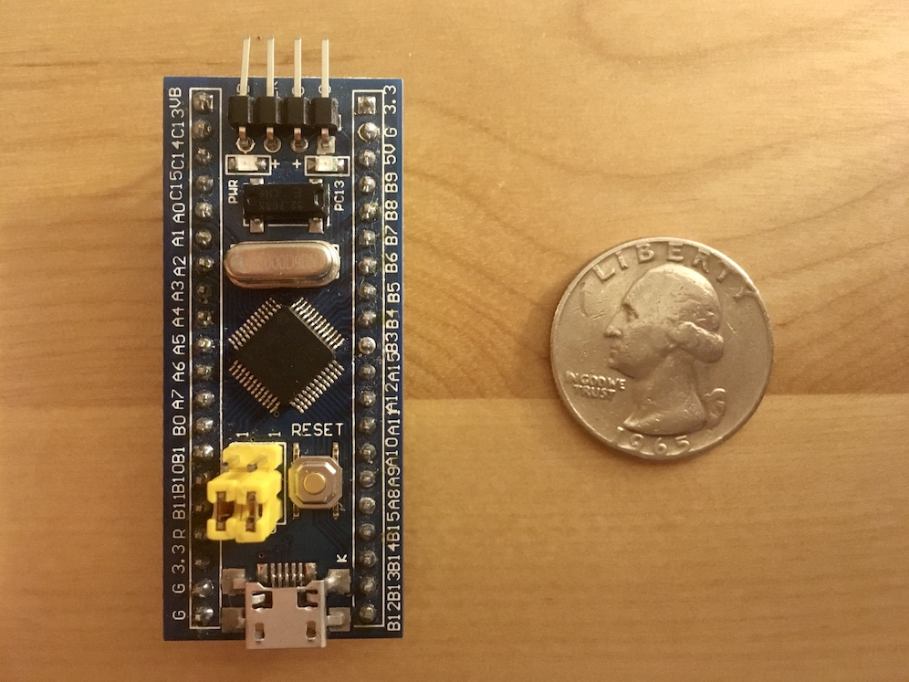

# Introduction

The [Blue Pill](https://stm32-base.org/boards/STM32F103C8T6-Blue-Pill) is a mysterious, brandless development board for the STM32F103 microcontroller.
You can buy one online for around $2.
(Fun, right?)

This is a project to program it to act like a tiny USB flash drive.

# Useful resources

## About the board

- [STM32F103C8 Datasheet](https://www.st.com/resource/en/datasheet/stm32f103c8.pdf) - Includes an overview of the device, electrical information, and the memory map.
- [RM0008](https://www.st.com/content/ccc/resource/technical/document/reference_manual/59/b9/ba/7f/11/af/43/d5/CD00171190.pdf/files/CD00171190.pdf/jcr:content/translations/en.CD00171190.pdf) - The reference manual for the STM32F family of devices, detailing their memory and peripherals.
- [PM0075](https://www.st.com/content/ccc/resource/technical/document/programming_manual/10/98/e8/d4/2b/51/4b/f5/CD00283419.pdf/files/CD00283419.pdf/jcr:content/translations/en.CD00283419.pdf) - How to access the device's flash memory.
- [The Blue Pill on STM32-base](https://stm32-base.org/boards/STM32F103C8T6-Blue-Pill) - An unofficial overview of the board, including a schematic.

## About USB

- [USB in a NutShell](https://www.beyondlogic.org/usbnutshell/usb2.shtml) - A hitchhiker's guide to USB implementation details.  Quite outdated ("USB 2.0...is still yet to see day light on mainstream desktop computers"), but still useful.
